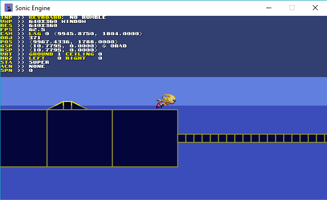

Sonic Engine v0.2.9 - Powered By Oficina Framework v1.3b
================================================

Made by Lucas Vieira (luksamuk) - lucas.samuel2002@gmail.com

Changelog
---------

v0.2.9
- Started implementing collision system by region-based collisions
  (still inefficient in terms of memory. DO NOT run it on Debug target.
  You have been warned);
- You can now toggle hitboxes and region view regardless of debug;
- Added water! (only sound effects and value changes);
- Added Super Sonic's flying sprite.

v0.2.5
- Added Super Sonic animations;
- Music now speeds up on Speed Shoes mode;
- Music changes depending on day's hour.

Objective
---------
This engine is a collision and physics study, turned to the purpose of
replicating the original Sonic engine from Genesis games, as much as possible.
This software was developed with the sole purpose of study, and as
proof-of-concept for Oficina Framework itself.

A Little Note
-------------
As you might notice, there is plenty of unfinished stuff there. I still plan to
handle collisions in a better way, as it only supports very specific ramps and
rectangles for now, placed by hand on a hardcoded function.
Implementing real maps with a clever way to handle collision detection is my next
assignment. It'll probably end up very close to Sonic's collisions, so I might
even create an internal editor... let's wait and see.

License
-------
The code for this engine is completely Public Domain (check LICENSE for
details). You can do whatever you want with the code.

However, I do not own any of the libraries specified on the Dependencies section
and, as of this current date (4/26/2016), I haven't publically disclosed the
source code for Oficina Framework, which is the actual engine running underneath
and managing everything, from screen to resolution to music playback. So if I
let you borrow the engine someday or if I disclose it, I ask you to respect its
license, whichever it is.

As for the binary release of this Sonic Engine, you can do whatever you want
with it; I also do not own Sonic nor anything related to it. All character
graphics, the debugger's font and music/sound effects are owned by SEGA.

Dependencies (Binary Release)
-----------------------------
Most dependencies are already included with the binary.
Software used is:

- OficinaFramework v1.3b (Snapshot 426)
- SDL2
- SDL2_image
- libpng
- libjpeg
- libogg
- libvorbis
- libvorbisfile
- PhysicsFS (libphysfs)
- zlib
- OpenGL 3.1
- OpenAL 1.1
- Visual C++ 2015 Redistributable

It may be necessary to install both OpenAL 1.1 and VC++2015 redistributable,
which are included on the "redist" folder. For VC++2015, choose whichever fits
the binary's architecture.

Build
-----
I highly recommend you not to. Download a release instead, if you want to test.
You'll need OficinaFramework v1.3b dependencies, as long as the framework itself,
to build this. Or you can simply grab a snapshot from releases section.
Check OficinaFramework's dependencies at https://luksamuk.github.io/OficinaFramework.
They're roughly the same for the binary, though.
If you're using Visual Studio 2015, you may want to tweak the include and libs directories
for all targets and platforms (just because I did it on my computer and I didn't want to
release the code before, duh). A Linux Makefile is planned soon.

Usage
-----
Simply open SonicEngine.exe.
Make sure you have OpenAL and Visual C++ 2015 Redistributable installed, as
pointed in the Dependencies section.

Controls
--------
Oficina Framework supports both keyboard controls and game controllers.
To use a game controller, simply connect it before starting the game.

- Keyboard:

| Key       | Codename |
|-----------|----------|
|WASD       | Directionals |
|K          | Action 1 |

- Xbox 360 Controller:

| Button    | Codename |
|-----------|----------|
|Left Stick | Directionals |
|A          | Action 1 |

Exit game at any time by manually closing the window.
If you close the window while loading, the game may hang until loading is
finished.

Player Actions
--------------
| Key                               | Action |
|-----------------------------------|--------|
|Directionals                       | Move |
|Action 1   (while on ground)       | Jump |
|Directional UP (if stopped)        | Look Up |
|Directional DOWN (if stopped)      | Crouch Down |
|Directional DOWN (if enough speed) | Roll |
|Action 1 (while crouched)          | Spindash. Mash button to increase speed, then release DOWN to roll |

Extra Controls
--------------
| Key                            | Action |
|--------------------------------|--------|
|Action 1 (on Powered By screen) | Next screen|
|F1 | Toggle debugger|
|F2 | Toggle debugger complexity (minimalistic debugger)|
|F3 | Reposition Sonic at beginning of level|
|F4 | Toggle hitboxes, grid regions, AABBs and sensors|
|F5 | Toggle linear filtering|
|F11| Toggle fullscreen|

Debug Mode
----------
Debug Mode only works if debugger is visible.
The following controls and actions can only be performed while Debug Mode
is active:

| Key/Situation | Action |
|---------------|--------|
|On Debug active   | Show tile collisions |
|   1 (non-numpad) | Reset character states |
|   2 (non-numpad) | Toggle Speed Shoes mode |
|   3 (non-numpad) | Toggle Super Sonic |
|      Mouse Click | Place Sonic on mouse position |
